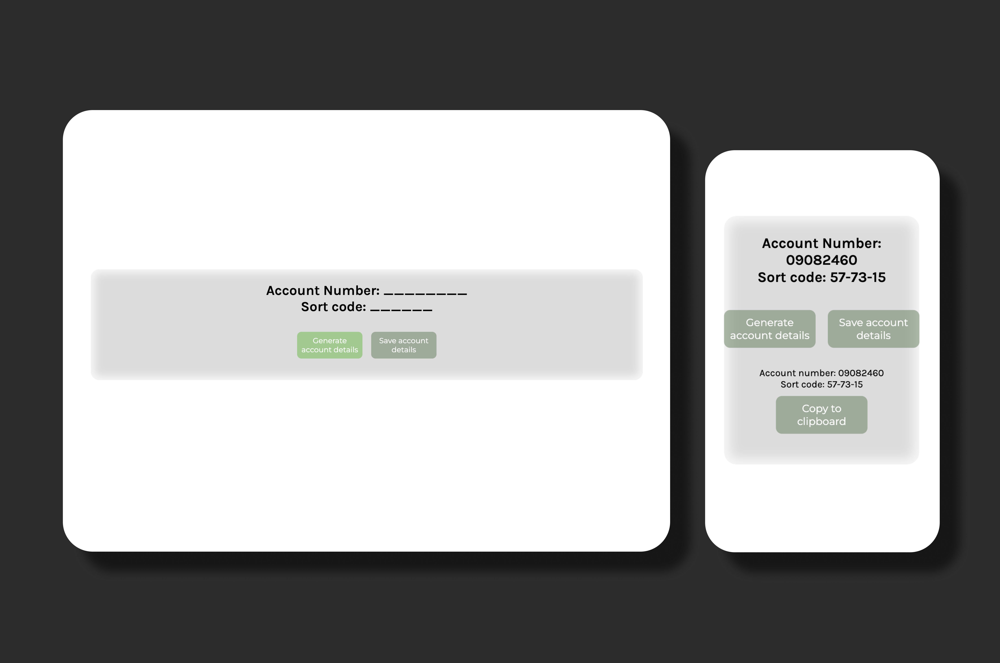

# bank-generator

Here's a README file in Markdown format for your bank details generator app:

```markdown
# Bank Details Generator

This is a simple web application that generates random bank account details, including an account number and a sort code.

## Preview



## Features

- Generates random account numbers and sort codes.
- Allows users to copy generated details to the clipboard.
- Provides an option to save generated details for reference.

## Technologies Used

- HTML
- CSS
- JavaScript

## How to Use

1. Clone this repository to your local machine.
2. Open the `index.html` file in your web browser.
3. Click on the "Generate account details" button to generate random account details.
4. Click on the "Save account details" button to save the generated details for reference.
5. Optionally, you can copy the generated details to the clipboard by clicking on the "Copy to clipboard" button.

## Credits

This project was created by Fedi.
```
